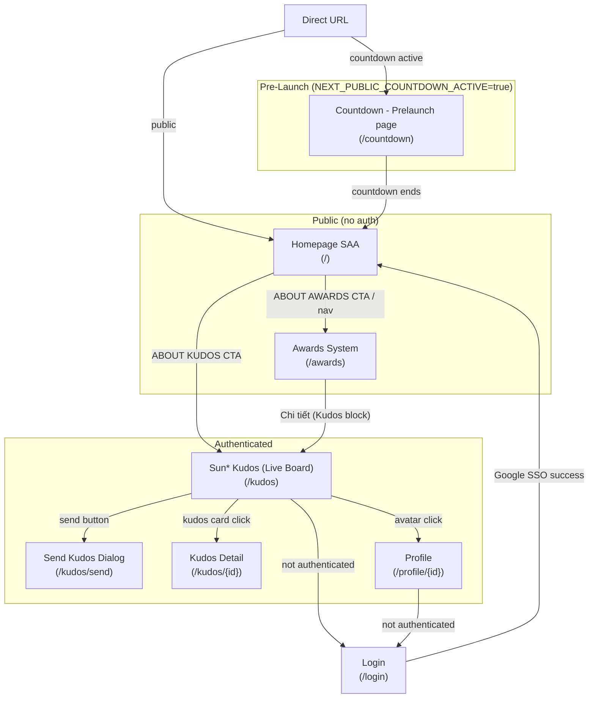
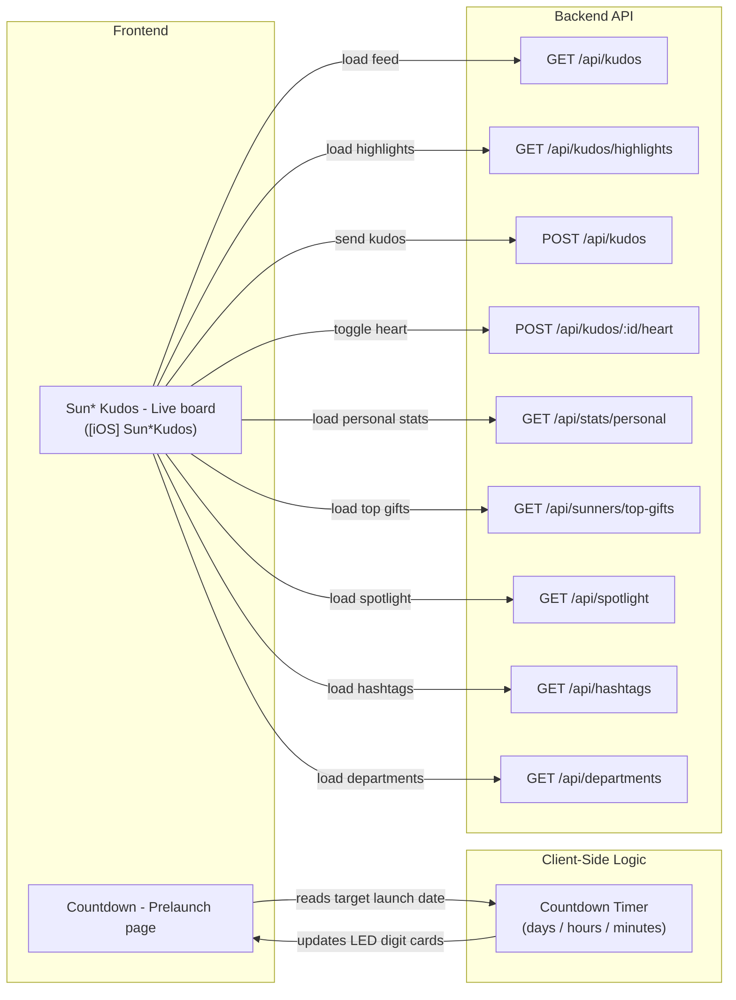

# Screen Flow Overview

## Project Info
- **Project Name**: agentic-coding-hands-on
- **Figma File Key**: 9ypp4enmFmdK3YAFJLIu6C
- **Figma URL**: https://www.figma.com/design/9ypp4enmFmdK3YAFJLIu6C
- **Created**: 2026-04-07
- **Last Updated**: 2026-04-09

---

## Discovery Progress

| Metric | Count |
|--------|-------|
| Total Screens | 6 |
| Discovered | 6 |
| Remaining | 0 |
| Completion | 100% |

---

## Screens

| # | Screen Name | Screen ID | Frame ID | Figma Link | URL | Status | Description | Navigations To |
|---|-------------|-----------|----------|------------|-----|--------|-------------|----------------|
| 1 | Countdown - Prelaunch page | 8PJQswPZmU | 2268:35127 | [Figma](https://www.figma.com/design/9ypp4enmFmdK3YAFJLIu6C?node-id=2268:35127) | `/countdown` | discovered | Pre-launch countdown page showing time remaining until event start | Redirects to main app when countdown ends |
| 2 | Homepage SAA | i87tDx10uM | 2167:9026 | [Figma](https://www.figma.com/design/9ypp4enmFmdK3YAFJLIu6C?node-id=2167:9026) | `/` | spec-created | Main homepage: keyvisual hero, Root Further text, awards grid preview, Kudos promo | `/awards`, `/kudos`, `/countdown` |
| 3 | Hệ thống giải (Awards System) | zFYDgyj_pD | 313:8436 | [Figma](https://www.figma.com/design/9ypp4enmFmdK3YAFJLIu6C?node-id=313:8436) | `/awards` | spec-created | Full awards catalog: 6 categories with sidebar nav (PC) / dropdown (SP), each showing prize image, description, count and value | `/kudos` (via Kudos block) |
| 4 | Login | GzbNeVGJHz | — | [Figma](https://www.figma.com/design/9ypp4enmFmdK3YAFJLIu6C) | `/login` | spec-created | Google SSO login page; redirects to `/` on success | `/` on auth success |
| 5 | Sun* Kudos - Live board | MaZUn5xHXZ | — | [Figma](https://www.figma.com/design/9ypp4enmFmdK3YAFJLIu6C?node-id=MaZUn5xHXZ) | `/kudos` | spec-created | Main Kudos Live Board page with hero/KV section, Highlight Kudos carousel, Spotlight network board, All Kudos feed, and personal stats sidebar | `/kudos/send` (send dialog), `/profile/{id}` (user profile), `/kudos/{id}` (kudos detail) |
| 6 | [iOS] Sun*Kudos | fO0Kt19sZZ | — | [Figma](https://www.figma.com/design/9ypp4enmFmdK3YAFJLIu6C?node-id=fO0Kt19sZZ) | `/kudos` (mobile layout) | spec-created | Mobile (iOS) version of the Kudos Live Board — same sections as PC but in single-column mobile layout | `/kudos/send` (send dialog), `/profile/{id}` (user profile), `/kudos/{id}` (kudos detail) |

---

## Navigation Graph

---

## Screen Groups

### Group: Pre-Launch
| Screen | Purpose | Entry Points |
|--------|---------|--------------|
| Countdown - Prelaunch page | Standalone holding page displayed before the main app launches; shows days, hours, and minutes remaining using LED-style digit cards | Direct URL access (`/countdown`) only; all routes redirect here when `NEXT_PUBLIC_COUNTDOWN_ACTIVE=true` |

### Group: Public (no auth required)
| Screen | Purpose | Entry Points |
|--------|---------|--------------|
| Homepage SAA | Main entry point: presents the event, awards overview, Root Further narrative, and Kudos promo | Direct URL `/`, countdown end redirect, header nav |
| Awards System | Full catalog of 6 award categories with details (PC sidebar + SP dropdown navigation) | `/awards`, "About Awards" CTA on homepage, "Award Information" header nav |

### Group: Authentication
| Screen | Purpose | Entry Points |
|--------|---------|--------------|
| Login | Google SSO sign-in for Sunners | Auth-gated pages redirect here; direct `/login` |

### Group: Sun* Kudos (Live Board)
| Screen | Purpose | Entry Points |
|--------|---------|--------------|
| Sun* Kudos - Live board (PC) | Main Kudos Live Board — hero/KV, Highlight Kudos carousel, Spotlight network, All Kudos feed, personal stats sidebar | "About Kudos" CTA on homepage, Awards Kudos block, direct `/kudos` |
| [iOS] Sun*Kudos (SP/Mobile) | Mobile version of the Kudos Live Board — same sections in single-column layout | Same as PC; served to mobile/iOS viewports at `/kudos` |

---

## API Endpoints Summary

| Endpoint | Method | Screens Using | Purpose |
|----------|--------|---------------|---------|
| _(none identified)_ | — | Countdown - Prelaunch page | Static countdown; no API calls required |
| `GET /api/kudos` | GET | Sun* Kudos - Live board, [iOS] Sun*Kudos | Fetch all kudos feed |
| `GET /api/kudos/highlights` | GET | Sun* Kudos - Live board, [iOS] Sun*Kudos | Fetch top highlighted kudos |
| `POST /api/kudos` | POST | Sun* Kudos - Live board, [iOS] Sun*Kudos | Create new kudos |
| `POST /api/kudos/:id/heart` | POST | Sun* Kudos - Live board, [iOS] Sun*Kudos | Toggle heart on kudos |
| `GET /api/stats/personal` | GET | Sun* Kudos - Live board, [iOS] Sun*Kudos | Fetch personal statistics |
| `GET /api/sunners/top-gifts` | GET | Sun* Kudos - Live board, [iOS] Sun*Kudos | Fetch top 10 gift recipients |
| `GET /api/spotlight` | GET | Sun* Kudos - Live board, [iOS] Sun*Kudos | Fetch spotlight network data |
| `GET /api/hashtags` | GET | Sun* Kudos - Live board, [iOS] Sun*Kudos | Fetch hashtag list |
| `GET /api/departments` | GET | Sun* Kudos - Live board, [iOS] Sun*Kudos | Fetch department list |

---

## Data Flow

---

## Technical Notes

### Countdown Page
- Standalone, no authentication required
- Displays time remaining as LED-style digit cards (days, hours, minutes)
- No inbound navigation links — accessed directly via `/countdown`
- Redirects to main app (`/`) automatically once countdown reaches zero

### Routing
- Router: Next.js App Router
- `/countdown` is a public, unprotected route

---

## Discovery Log

| Date | Action | Screens | Notes |
|------|--------|---------|-------|
| 2026-04-07 | Initial discovery | Countdown - Prelaunch page | Screen ID: 8PJQswPZmU, Frame ID: 2268:35127 |
| 2026-04-07 | Spec created | Homepage SAA | Screen ID: i87tDx10uM, Frame ID: 2167:9026 |
| 2026-04-07 | Spec created | Login | Screen ID: GzbNeVGJHz |
| 2026-04-08 | Spec created | Hệ thống giải (Awards System) | Screen ID: zFYDgyj_pD, Frame ID: 313:8436 — both PC and SP layouts documented |
| 2026-04-09 | Spec created | Sun* Kudos - Live board (PC) | Screen ID: MaZUn5xHXZ, Frame name: Sun* Kudos - Live board, File Key: 9ypp4enmFmdK3YAFJLIu6C — hero/KV, highlights carousel, spotlight, all-kudos feed, personal stats sidebar |
| 2026-04-09 | Spec created | [iOS] Sun*Kudos (SP/Mobile) | Screen ID: fO0Kt19sZZ, Frame name: [iOS] Sun*Kudos, File Key: 9ypp4enmFmdK3YAFJLIu6C — mobile single-column layout of Kudos Live Board |

---

## Next Steps

- [ ] Complete discovery for remaining screens
- [ ] Verify navigation paths
- [ ] Map all API endpoints
- [ ] Review with design team
